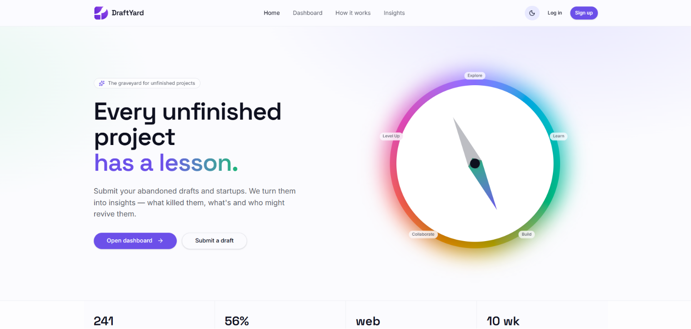
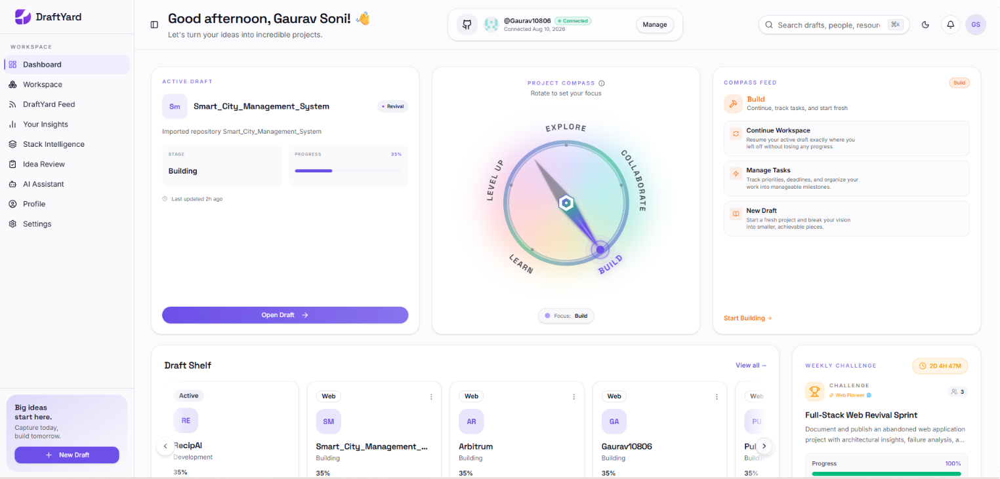
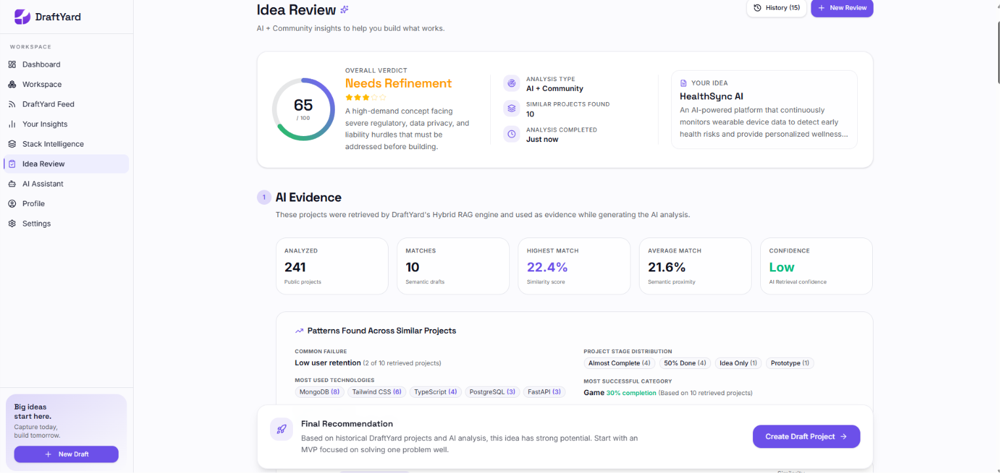
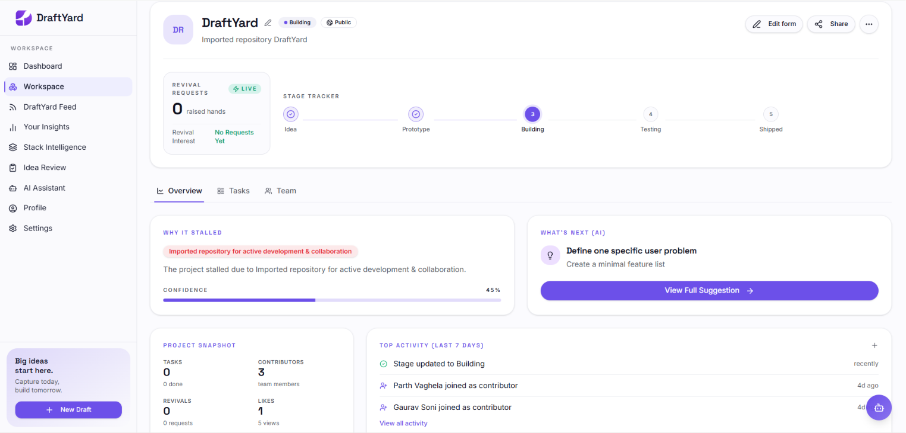
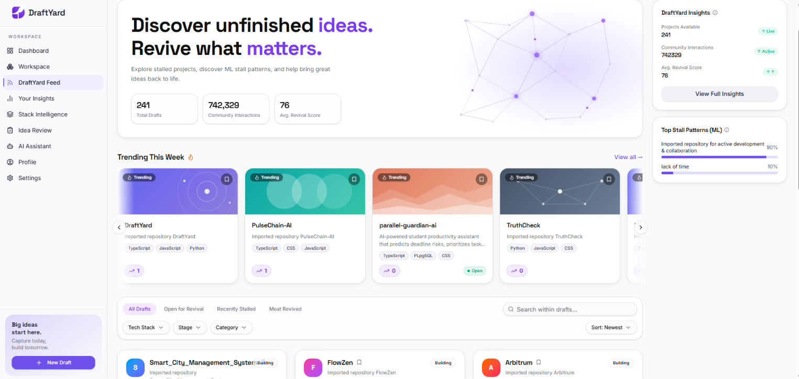
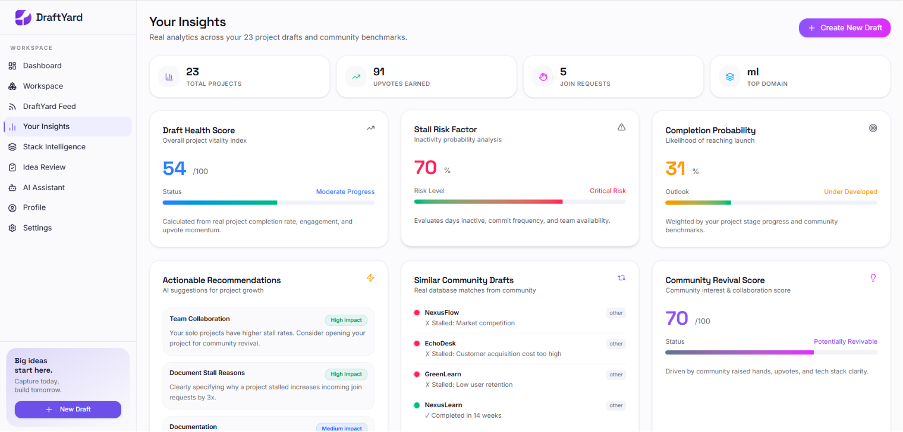
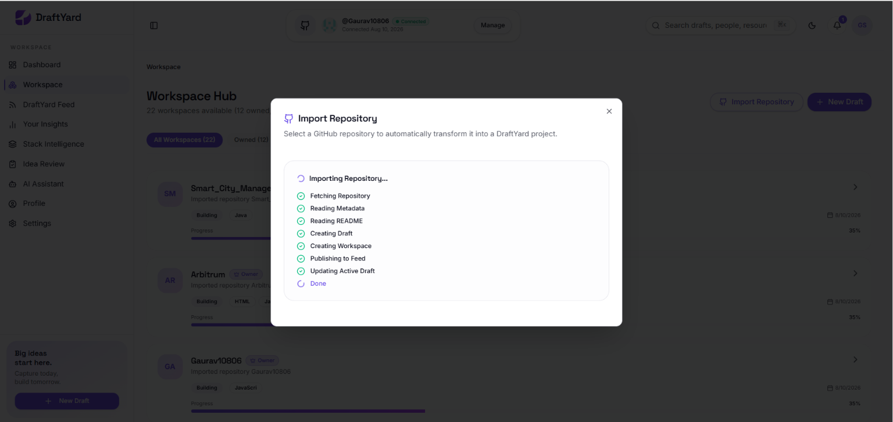

# 🚀 DraftYard

> **AI-Powered Collaborative Platform for Reviving Startup Ideas**

[]()
[]()
[]()
[]()
[]()

DraftYard is an AI-powered collaborative platform that helps developers validate startup ideas, revive unfinished software projects, discover similar work using Hybrid RAG retrieval, and collaborate with other builders to bring promising ideas back to life.

---

# 🌐 Live Demo

### 🚀 Live Website

https://draft-yard.vercel.app/

### 📂 GitHub Repository

https://github.com/Gaurav10806/DraftYard

---

# ✨ Key Features

### 🤖 AI-Powered Idea Review

- AI feasibility analysis
- Market potential assessment
- Risk identification
- AI recommendations
- Suggested tech stack

---

### 🔍 Hybrid RAG Retrieval

- Sentence Transformer embeddings
- Semantic similarity search
- Metadata-aware re-ranking
- Similar project discovery

---

### 👥 Community Collaboration

- Revive abandoned projects
- Join development teams
- Community Feed
- Revival requests

---

### 📂 Draft Workspace

- Task management
- Stage tracking
- Team collaboration
- Progress monitoring

---

### 📊 Intelligent Insights

- Personal project analytics
- Community analytics
- Stack Intelligence
- AI Assistant

---

### 🔐 Authentication

- JWT Authentication
- Google OAuth 2.0
- GitHub OAuth

---

# 🏗️ System Architecture

```
                React + TanStack Start
                        │
                        ▼
              Node.js + Express Server
                        │
          ┌─────────────┴─────────────┐
          ▼                           ▼
     MongoDB Database          Django ML Backend
                                        │
                          Hybrid RAG Retrieval Engine
                                        │
                           Sentence Transformers
                                        │
                               Google Gemini API
                                        │
                              AI Idea Analysis
```

---

# 🧠 AI Workflow

1. User submits an idea.
2. Project title, pitch, and context are combined.
3. Sentence Transformer generates semantic embeddings.
4. Hybrid RAG searches similar projects.
5. Metadata-aware re-ranking improves search quality.
6. Google Gemini analyzes retrieved evidence.
7. AI generates recommendations and insights.
8. Results are displayed to the user.

---

# 🛠️ Tech Stack

## Frontend

- React 19
- TypeScript
- TanStack Start
- Tailwind CSS
- Framer Motion
- Radix UI

---

## Backend

- Node.js
- Express.js
- Django
- Django REST Framework

---

## Database

- MongoDB
- Mongoose

---

## AI & Machine Learning

- Google Gemini API
- Sentence Transformers
- Hybrid RAG Retrieval
- Semantic Search
- Metadata-aware Re-ranking

---

## Authentication

- JWT
- Google OAuth 2.0
- GitHub OAuth

---

# 📁 Project Structure

```
DraftYard/
│
├── client/             # React Frontend
├── server/             # Express Backend
├── ml-backend/         # Django AI Backend
├── docs/
│   └── screenshots/
└── README.md
```

---

# 📸 Screenshots

## 🌐 Landing Page



---

## 📊 Dashboard



---

## 🤖 AI Idea Review



---

## 💼 Workspace



---

## 🌍 Community Feed



---

## 📈 Insights Dashboard



---

## 🐙 GitHub Repository Import



---

# ⚙️ Installation

Clone the repository

```bash
git clone https://github.com/Gaurav10806/DraftYard.git
cd DraftYard
```

---

## Frontend

```bash
cd client
npm install
npm run dev
```

---

## Backend

```bash
cd server
npm install
npm run dev
```

---

## ML Backend

```bash
cd ml-backend
pip install -r requirements.txt
python manage.py runserver
```

---

# 🔑 Environment Variables

## Server (.env)

```env
PORT=
MONGO_URI=
JWT_SECRET=

GOOGLE_CLIENT_ID=
GOOGLE_CLIENT_SECRET=
GOOGLE_CALLBACK_URL=

GITHUB_CLIENT_ID=
GITHUB_CLIENT_SECRET=
GITHUB_CALLBACK_URL=
```

---

## ML Backend (.env)

```env
GEMINI_API_KEY=
MONGODB_URI=
```

---

# 🚀 Future Scope

- AI Contributor Matching
- Advanced Project Analytics
- Mentor & Investor Discovery
- Mobile Application
- Project Recommendation Engine
- Multi-language Support

---


# 📄 License

This project was developed for educational and academic purposes.

---

## ⭐ Support

If you found this project interesting, consider giving it a **Star ⭐** on GitHub!
